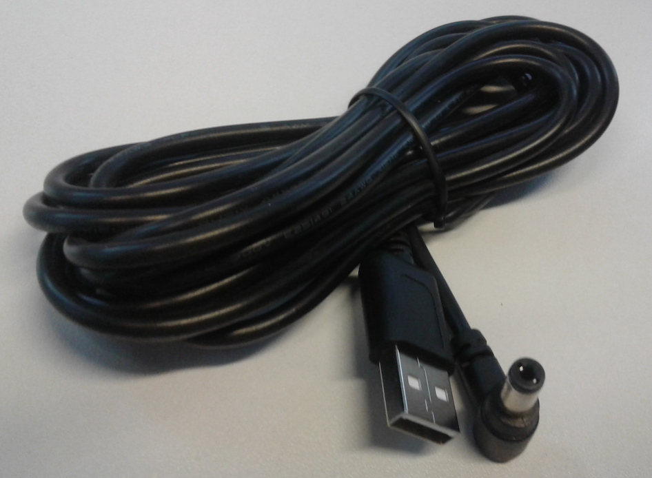

## Hardware Review

### Pozyx Anchor

*Anchors are modules with a fixed and known position. For 3D positioning you need at least 4 anchors.
The anchors have the same role as satellites in GPS positioning. 
Note that, with our automatic anchor calibration feature, you do not need to acquire the position of the anchor yourself, it is done automatically for you.*

this is the pozyx anchor with a lid.

The side of the case. It has 1x micro USB jack and 1x power jack.
It is possible to provide power to the anchor with micro USB cable. 

A sticker on the other side cleary shows its serial number.

The size comparison between a credit card and an anchor.

Strange USB to power cable. Presumably, the company tried to avoid providing batteries and DC adapters. However USB cable has a range limitation (officially 5 meters) and might require an extension with power booster if we extend USB cable.

[Article about USB extension](http://www.yourcablestore.com/USB-Cable-Length-Limitations-And-How-To-Break-Them_ep_42-1.html)

I think, its better to replace this cable with a real 5v DC adapters. This cable is just for a test not for the deployment and also the color of the cable is very nice for the exhibition space (usually a white box).

### Pozyx tags

The position of this tags are reported by the system.
This device can be shipped with or without heades for Arudino. My version is with headers soldered onto the PCB.

This is the UWB module. It's smaller than 1cm x 1cm.

Backside of the PCB. The soldering quality is terrible as a commercial product.

The power supply is similar to the anchor.

The size is very similar to the anchor or slightly smaller. For the amount of components on top of the PCB, the size is very big, presumably for Arduino compatibility.

### Conclusion

Hardware built quality is not very impressive and the design of power supply is questionable though it can be easily replacable with very common AC-to-5v mini usb adapter, if necessary.
