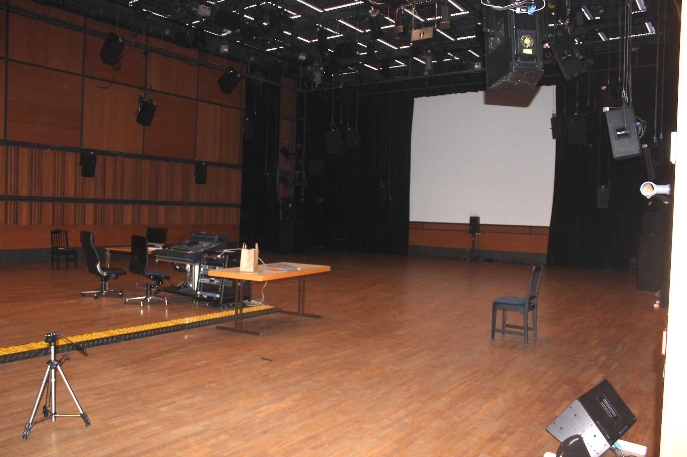
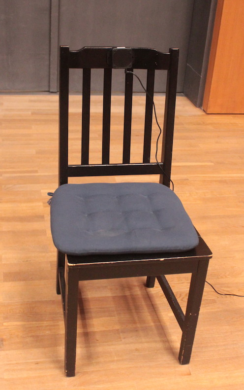
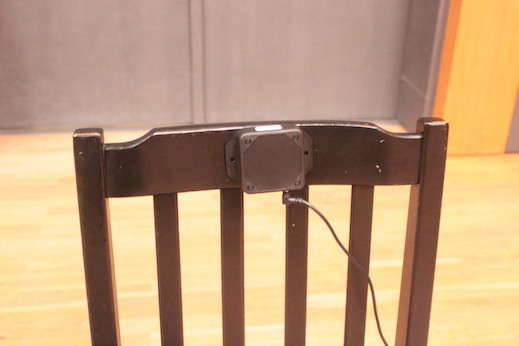
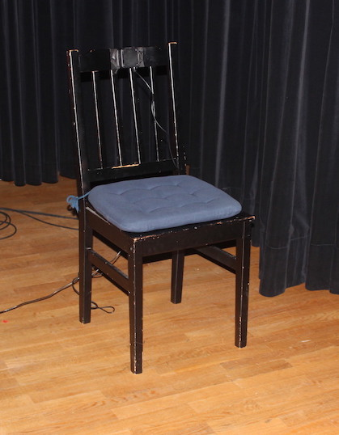
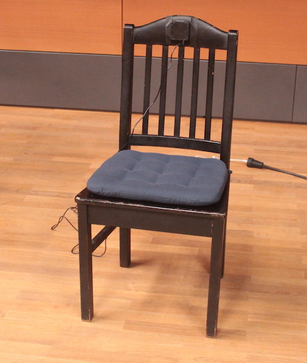
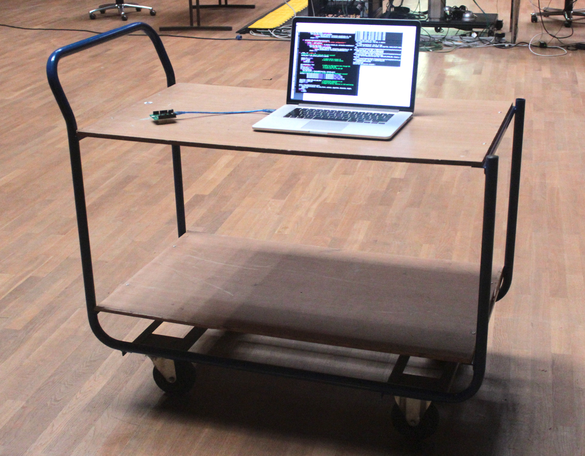

## Testing in a 10m x10m space

This page describes my test with "ready to localize" kit at ZKM Karlsruhe on September. 2 2017.

#### Test Venue
ZKM Kubus

#### Anchors
Anchors are placed on the back of 4 chairs. The website says, it's better to put them on the wall for the better result. However, the site also says, metallic objects should be not placed near to the achors. Unfortunetely, metallic pipes are exposed on the walls. So I decided to put anchors on the wood chairs.

   

#### Placement
The follwoing diagram shows the placement of the anchors. The covered space is bigger than 100 squaremeters.

#### Tag

The Pozyx Tag requires a power (USB +5v), so I put both my laptop and pozyx on a cart and moved around in the space.

#### Video of the experiement

You can watch a video of the test.

#### Data Deviation without movement

I sample 450+ data (x position) without movement
[See data](static_data.txt)

#### Sonification
With a simple max patch the position data is mapped to the frequency of  a sawtooth.

#### Sound Spots
I placed three virtual spots in the space and programmed to trigger three different sounds if the pozyx holder enters the circle.

#### With Lowpass
In order to avoid the erros, I applied simple lowpass to the position data. (Turn up the volume. The sound is too soft in the video.)

### Conclusion

The system is working but it requires very careful calibration.
The incoming data contain a significant amount of noise, though the setting was not very optimal (There is a metalic loudspeaker close to one anchor and the position of the anchor was not high enough. It should be placed close to the ceiling), we cannot depoly the system always in a very optimal situation. More tolerance against suboptimal setup is expected.

The frame rate of the data is also not very high. If the number of data is higher, we could apply more stronger algorithms against noise.
